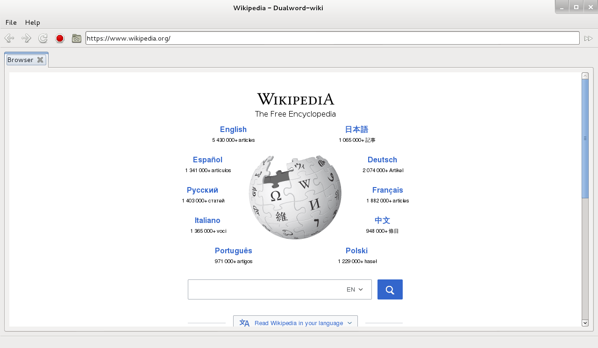

# Dualword-wiki

Dualword-wiki - enhanced [Wikipedia](http://www.wikipedia.org) web browser (
[C++](http://www.isocpp.org), [Qt](http://www.qt.io), [WebKit](http://www.webkit.org) ).

Features:
 - access to Wikipedia website only.
	
How to build:
 - prerequisites: Qt 4.8.6
 - qmake
 - make

License: GNU GENERAL PUBLIC LICENSE Version 3  
Source code: http://github.com/dualword/dualword-wiki/

Third Party Software:
 - Qt 4.8.6 license:LGPL v2.1

