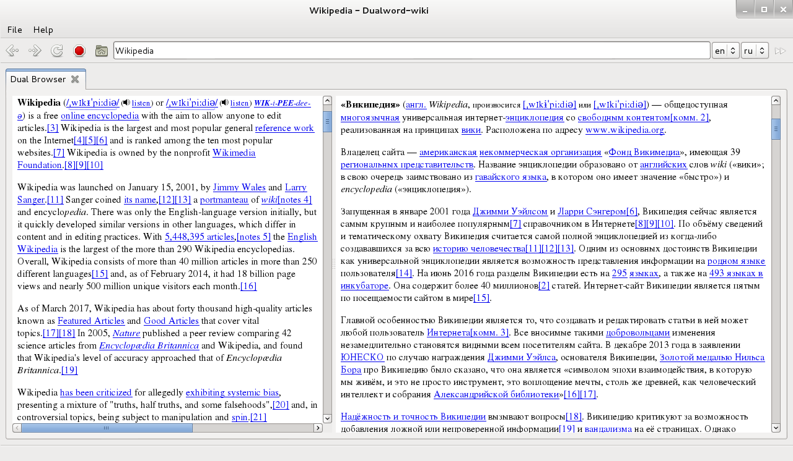
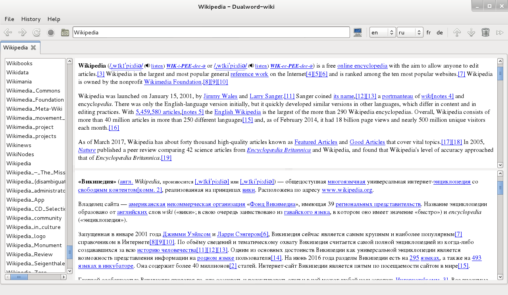

Dualword-wiki - [Wikipedia](https://www.wikipedia.org) browser.

Features:
 - site-specific web browser with access to the Wikipedia websites:
	wikipedia.org, wiktionary.org, wikibooks.org, wikiversity.org, wikinews.org,
	wikivoyage.org, wikisource.org, wikidata.org, wikiquote.org, wikimedia.org
 - dual browser (dual language) tabs with access to wikipedia.org website
 - buttons: "Like", "Dislike", "Next page"
			
License: GNU GENERAL PUBLIC LICENSE Version 3  
Source code: https://github.com/dualword/dualword-wiki  

Third Party Software:
 - Qt License: LGPL v3

